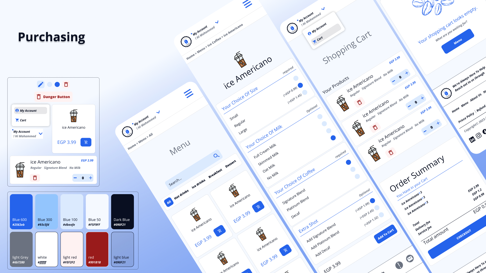

# MCoffee

Welcome to MCoffee, 

MCoffee is a user-friendly web application designed for coffee lovers. Users can browse through the menu and search for their favorite coffee beverages from the comfort of their home or on the go.

## Visit
You can visit the live page of MCoffee: [here](https://m-coffee-chi.vercel.app/).

and you can use this email and password  

email : nu@gmail.com  
password : 123123  

### Show Case



## Features

- **View Menu**: Browse a variety of coffee drinks and pastries.
- **Order Coffee**: Select and order your favorite coffee.
- **User Authentication**: Sign up and log in to save your orders and preferences.
- **Order History**: View past orders and reorder quickly.

## Technologies

- **Framework**: Next.js TypeScript
- **Styling**: Tailwind CSS, shadcn UI Toast Notifications
- **TypeScript-first schema validation**: Zod
- **Database**: Prisma with MongoDB
- **Authentication**: NextAuth JWT

## Installation

Follow these steps to get a copy of the project up and running on your local machine.

1. **Clone the repository**
    ```bash
    git clone https://github.com/imohammedhamed/MCoffee.git
    ```
2. **Navigate to the project directory**
    ```bash
    cd MCoffee
    ```
3. **Install dependencies**
    ```bash
    npm install
    ```
4. **Add necessary dependencies**
    ```bash
    npm install @hookform/resolvers @next-auth/prisma-adapter @prisma/client @prisma/extension-accelerate @radix-ui/react-alert-dialog @radix-ui/react-avatar @radix-ui/react-dialog @radix-ui/react-label @radix-ui/react-slot @ts-morph/common class-variance-authority clsx framer-motion lucide-react next-auth react react-dom react-hook-form react-hot-toast react-icons shadcn-ui solid-toast sonner tailwind-merge tailwindcss-animate ts-morph zod
    ```
5. **Add necessary dev dependencies**
    ```bash
    npm install --save-dev @types/node @types/react @types/react-dom daisyui eslint eslint-config-next postcss prisma tailwindcss ts-node typescript
    ```
6. **Start the application**
    ```bash
    npm run dev
    ```

## Usage

After starting the application, you can access it in your web browser at `http://localhost:3000`. From there, you can browse the menu, select items, and place an order.

## Contributing

We welcome contributions to the project! To contribute, follow these steps:

1. Fork the repository.
2. Create a new branch.
    ```bash
    git checkout -b feature-branch
    ```
3. Make your changes.
4. Commit your changes.
    ```bash
    git commit -m "Add some feature"
    ```
5. Push to the branch.
    ```bash
    git push origin feature-branch
    ```
6. Open a pull request.

## Getting Started

First, run the development server:

```bash
npm run dev
# or
yarn dev
# or
pnpm dev
# or
bun dev
```
Open http://localhost:3000 with your browser to see the result.

You can start editing the page by modifying app/page.tsx. The page auto-updates as you edit the file.

This project uses next/font to automatically optimize and load Inter, a custom Google Font.

## Learn More
To learn more about Next.js, take a look at the following resources:

Next.js Documentation - learn about Next.js features and API.
Learn Next.js - an interactive Next.js tutorial.
You can check out the Next.js GitHub repository - your feedback and contributions are welcome!

Deploy on Vercel
The easiest way to deploy your Next.js app is to use the Vercel Platform from the creators of Next.js.

Check out our Next.js deployment documentation for more details.

## Contact
For any questions or suggestions, feel free to reach out:

Email: mohammedhamed6726@gmail.com

GitHub: imohammedhamed

Enjoy your coffee with MCoffee!
